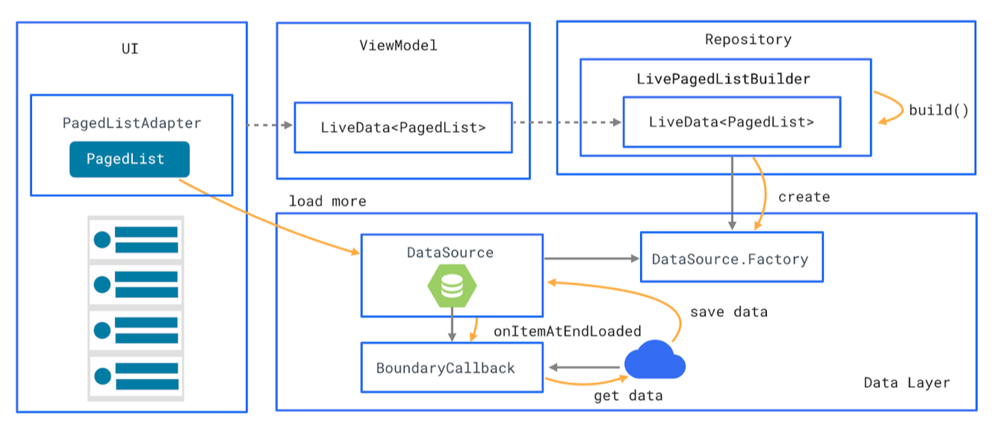

# Jetpack 스터디 – paging library 


### 1. paging library overview



> (1) PagedList : 페이지에서 데이터를 비동기적으로 로드하는 컬렉션 
>
> (2) DataSource : 데이터의 snapshots을 PagedList에 로드해주는 base class 
>
> (3) DataSource.Factory : DataSource 생성
>
> (4) LivePagedListBuilder : DataSource.Factory와 PagedList.Config를 기반으로 LiveData<PagedList> 만듦
>
> (5) BoundaryCallback : PagedList가 사용 가능한 데이터의 끝에 도달했을 때 신호를 보냅니다.
>
> (6) PagedListAdapter - RecyclerView의 PagedLists에서 페이징된 데이터를 표시하는 RecyclerView.Adapter
>
> 출처 : [https://codelabs.developers.google.com/codelabs/android-paging/index.html#0](https://codelabs.developers.google.com/codelabs/android-paging/index.html) 


### 2. DataSource Class

| DataSource           | 데이터의 snapshots을 PagedList에 제공해주는 base class       |
| -------------------- | ------------------------------------------------------------ |
| ItemKeyedDataSource  | item의 key를 이용해 paging                                   |
| PageKeyedDataSource  | 인접 page에 대한 정보를 이용해 paging                        |
| PositionalDataSource | Fixed-size, countable data set을 제공해주는 위치 기반 DataSource |

### 3. 실습

####  (1) RecyclerView paging -> paging library로 변환

- basic branch 부터 commit log 를 따라서 실습합니다.

  - Load data in chunks with the PagedList 

    > - PagedList는 DataSource로 부터 데이터를 chunks(pages)로 로드하는 List
    > - 현재 상태에 대한 snapshot이 존재하므로, 데이터가 변경되었다는 callback을 통해 update 할 수 있다.

    ```
    변경 : PagedList로 불러올 데이터와 관련된 파일
    1. RepoSearchResult는 데이터를 표시하기 위해 UI에서 사용하는 데이터 모델
    2. SearchRepositoriesViewModel
    3. SearchRepositoriesActivity는 ViewModel의 repos를 관찰합니다. 
    ```

    

  - Define the source of data for the PagedList 

    > - PagedList는 DataSource에서 내용을 동적으로 로드. 이 예제의 경우 데이터베이스가 UI의 main source이기 때문에 PagedList의 main source가 된다.
    > - 앱이 네트워크에서 직접 데이터를 가져와 caching하지 않고 표시하는 경우 네트워크 요청을 하는 클래스가 data source가 됩니다.
    > - DataSource.Factory를 구현해야 DataSource 생성됨.
    > - Dataset이 업데이트 될 때마다 DataSource가 invalidate되고 DataSource.Factory를 통해 자동으로 다시 생성됩니다.
    > - Room persistence library는 paging library와 연관된 데이터 소스를 기본적으로 지원합니다. 주어진 쿼리에 대해 Room은 DAO에서 DataSource.Factory를 반환하고 DataSource 구현을 처리합니다. 

    ```
    변경
    1. RepoDao
    2. GithubLocalCache
    ```

    

  - Build and configure a PagedList 

    > - GithubRepository 빌드 오류
    >   - 원인 : 현재 viewModel에서 repository의 data로 pagedList를 구성 -> DataSource로 데이터를 로드한 후 PagedList로 반환해야 함
    > - LivePagedListBuilder : LiveData<PagedList> build 및 config 설정제공 
    >   - PagedList에 의해 로드된 페이지의 크기 
    >   - 처음 로드할 item 수 
    >   - Null 항목이 pagedList에 추가되는지 여부. 아직 로드되지 않은 데이터를 나타냄 

    ```
    변경
    1. GithubRepository
    ```
    

  - Make the RecyclerView Adapter work with a PagedList 

    > - PagedList를 RecycleView에 binding하려면 PagedListAdapter 사용 
    > - PagedListAdapter는 PagedList 내용이 로드 될 때마다 알림을 받고 RecyclerView가 업데이트하도록 신호를 보냅니다. 
    > - 현재 구현되어 있지만 DiffUtil.ItemCallback 을 반드시 구현해야 합니다. 
    
    ```
    변경
    1. ReposAdapter
    ```
    

  - Trigger network updates : Paging library가 list scrolling 처리하도록 하자!  

    > - 사용자 정의 스크롤 처리를 제거 
    > - 문제 발생 - 데이터의 초기로드에서 item이 반환되었거나, DataSource의 데이터 끝에 도달했기 때문에 data source에 더 이상 제공 할 데이터가 없는 경우
    >   - BoundaryCallback을 구현 : 더 많은 데이터를 요청할 시기를 알 수 있습니다.  

    ```
    변경
    1. 삭제
    - SearchRepositoriesActivity : setupScrollListener
    - SearchRepositoriesViewModel : listScrolled
    - requestMore
    2. 구현
    - RepoBoundaryCallback Class : 특정 쿼리에 대한 네트워크 요청 및 데이터베이스 데이터 저장을 처리
    - BoundaryCallback 으로 더 많은 데이터를 요청하는 것과 관련된 메서드를 이동
    - PagedList를 만들 때 BoundaryCallback을 사용하도록 GithubRepository를 수정
    ```

출처 : [https://codelabs.developers.google.com/codelabs/android-paging/index.html#0](https://codelabs.developers.google.com/codelabs/android-paging/index.html) 


####   (2) DataSource subClass 적용

- study_datasource branch부터 commit log 를 따라서 실습합니다.

출처 : <https://github.com/googlesamples/android-architecture-components/tree/master/PagingWithNetworkSample> 